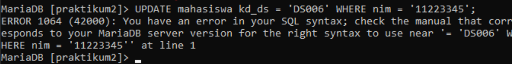
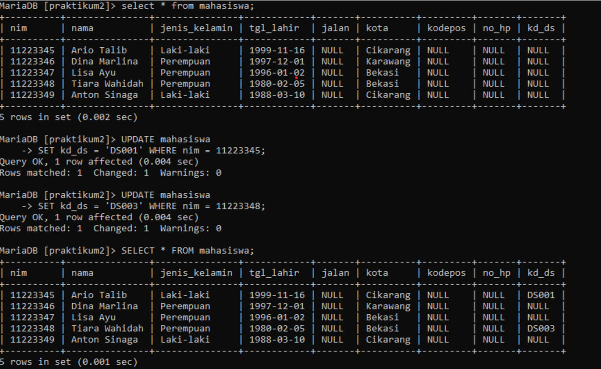
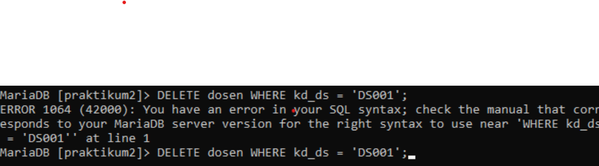
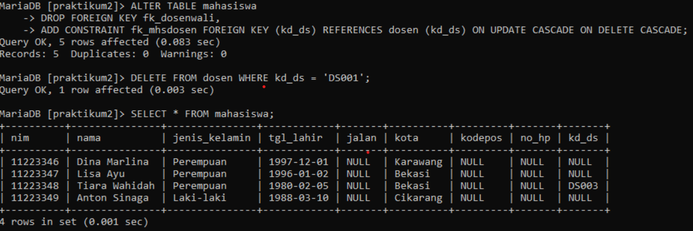
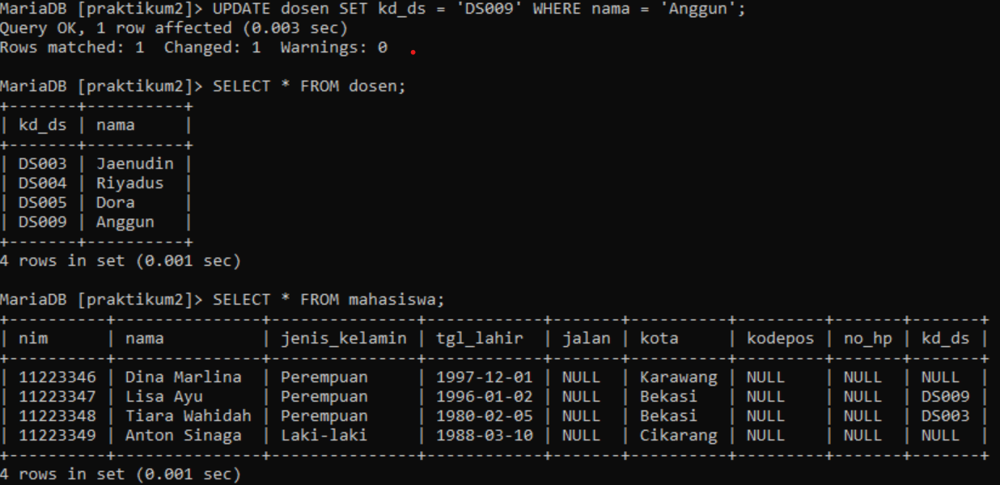
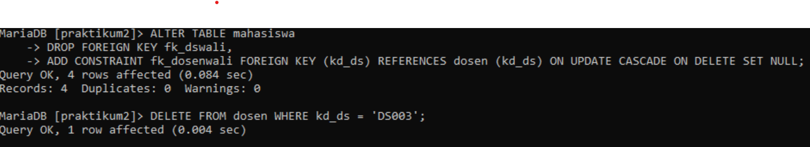

# Praktikum3_SQL

## **CONSTRAINT FOREIGN KEY**         


####  **Langkah-langkah Praktikum**

1. Lakukan penambahan data pada table mahasiswa dengan mengisi kd_ds yang belum ada pada data dosen.

    ```sql
    UPDATE mahasiswa
    SET kd_ds = 'DS011' WHERE nim = 112233445;
    ```

    **Contoh:** <br>
    <br>
    <br>

2. Hapus satu record data pada table dosen yang telah dirujuk pada tabel mahasiswa.

    ```sql
    DELETE FROM dosen WHERE kd_ds = 'DS001';
    ```

    **Contoh:** <br>
    <br>

3. Ubah mode menjadi ON UPDATE CASCADE ON DELETE RESTRICT

    ```sql
    ALTER TABLE mahasiswa
    DROP FOREIGN KEY fk_mahasiswa_dosen,
    ADD CONSTRAINT fk_dosenwali FOREIGN KEY (kd_ds) REFERENCES dosen(kd_ds) ON UPDATE CASCADE ON DELETE CASCADE;
    ```

    ```sql
    ALTER TABLE mahasiswa
    DROP FOREIGN KEY fk_mahasiswa_dosen,
    ADD CONSTRAINT fk_dosenwali FOREIGN KEY (kd_ds) REFERENCES dosen(kd_ds) ON UPDATE CASCADE ON DELETE RESTRICT;
    ```

    **Contoh:**<br>
    <br>

4. Lakukan perubahan data pada tabel dosen.

    ```sql
    UPDATE dosen
    SET kd_ds = 'DS003' WHERE nama = 'Usop';
    ```

    **Contoh:**<br>
    <br>

5. Lakukan penghapusan data pada tabel dosen (kd_ds). Ubah mode menjadi ON UPDATE CASCADE ON DELETE SET NULL.

    ```sql
    ALTER TABLE mahasiswa
    DROP FOREIGN KEY fk_mahasiswa_dosen,
    ADD CONSTRAINT fk_dosenwali FOREIGN KEY (kd_ds) REFERENCES dosen(kd_ds) ON UPDATE CASCADE ON DELETE RESTRICT;
    ```

    ```sql
    ALTER TABLE mahasiswa
    DROP FOREIGN KEY fk_mahasiswa_dosen,
    ADD CONSTRAINT fk_dosenwali FOREIGN KEY (kd_ds) REFERENCES dosen(kd_ds) ON UPDATE CASCADE ON DELETE NOT NULL;
    ```

    ```sql
    DELETE FROM dosen WHERE nim = 'DS003';
    ```

    **Contoh:** <br>
    <br>


# FINISH